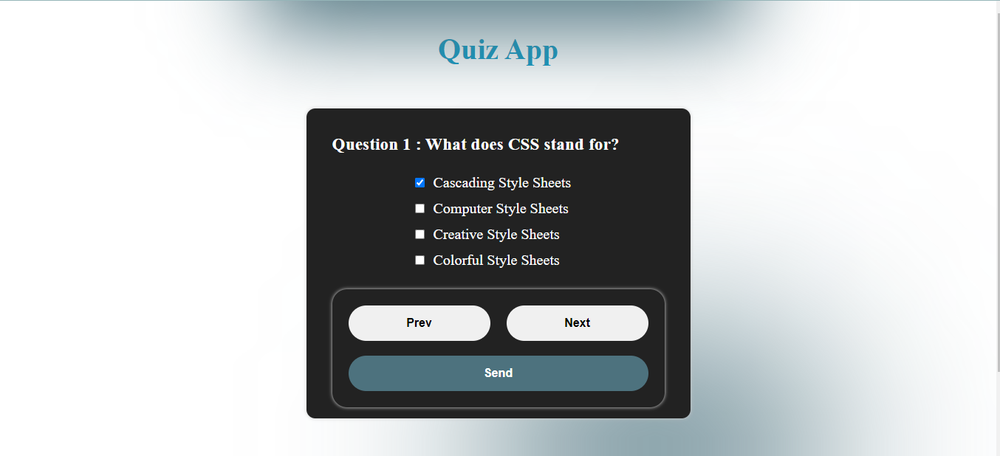

# Quiz App Projet 

Bienvenue dans le projet de Quiz App ! Ce projet a été créé par HTML, CSS et JAVASCRIPT pour développer une application qui pose des questions et affiche votre score dans un popup de js.

## Aperçu



## Technologies Utilisées

- **HTML**
- **CSS**
- **JS**

## Instructions d'utilisation

**Installation :** Clonez le repository sur votre machine locale.
   ```bash
   git clone https://github.com/sm-hl/quiz_app.git


